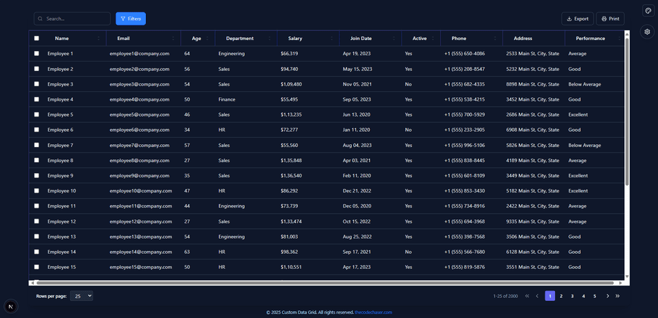
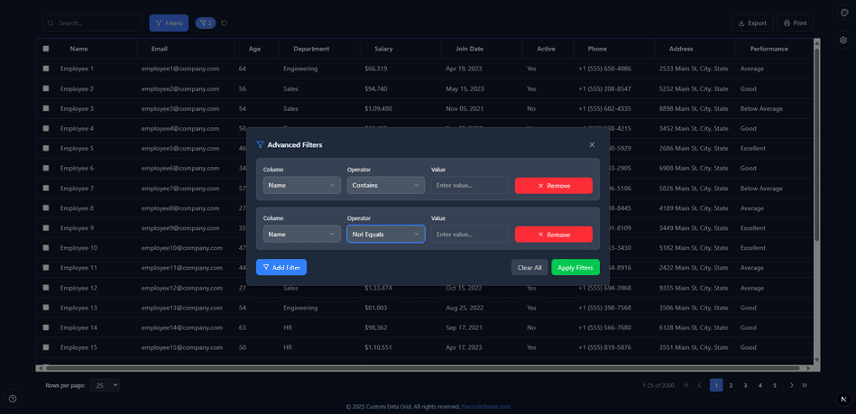
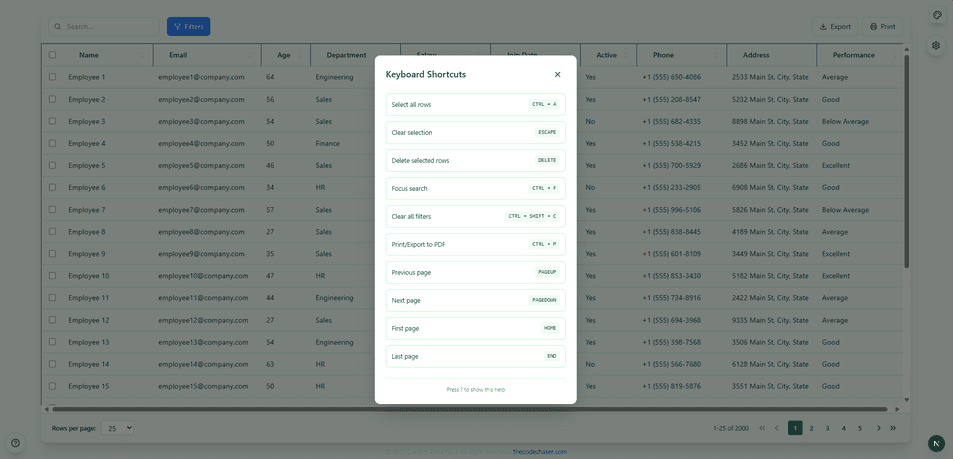

# Custom Data Grid

> Custom Data Grid is a high-performance, feature-rich custom table component build from scratch without any additional library. It supports dynamic column rendering, row virtualization, and multi-column sorting. Users can search, filter, paginate, and export data with ease. Advanced tools include column pinning, resizing, reordering, and grouping. With inline editing, bulk actions, and customizable cell types.

## Preview:







## Built With

- HTML
- CSS
- JavaScript
- TypeScript
- NextJS
- Zustand
- Tailwind CSS
- Framer Motion

## Live version

[Custom Data Grid](https://data-grid.thecodechaser.com)

## Getting Started

To get a local copy up and running follow these simple example steps.

### Prerequisites
- A text editor(preferably Visual Studio Code)
- Node
- Web browser

### Install
- [Git](https://git-scm.com/downloads)
- [Node](https://nodejs.org/en/download/)

### Using it Locally

- Clone the project

```bash 
git clone git@github.com:thecodechaser/custom-data-grid.git

cd custom-data-grid
```

- Install dependencies

```bash
npm i 
or
npm install
```
- To Start the development server
```bash
npm run dev
```

- To test the project
```bash
npm run test
```


## Visit And Open Files

[Visit Repo](https://github.com/thecodechaser/custom-data-grid)

## Download Repo

[Download Repo](https://github.com/thecodechaser/custom-data-grid/archive/refs/heads/main.zip)

## Authors

👤 **Ranjeet Singh**

- Website: [thecodechaser.com](https://thecodechaser.com)
- GitHub: [@thecodechaser](https://github.com/thecodechaser)
- Twitter: [@thecodechaser](https://twitter.com/thecodechaser)
- LinkedIn: [thecodechaser](https://linkedin.com/in/thecodechaser)

## 🤝 Contributing

Contributions, issues, and feature requests are welcome!

Feel free to check the [issues page](https://github.com/thecodechaser/custom-data-grid/issues).

## Show your support

Give a ⭐️ if you like this project!

## Acknowledgments

- Inspiration: Sat N Paper

## 📝 License

This project is [MIT](./LICENSE) licensed.
